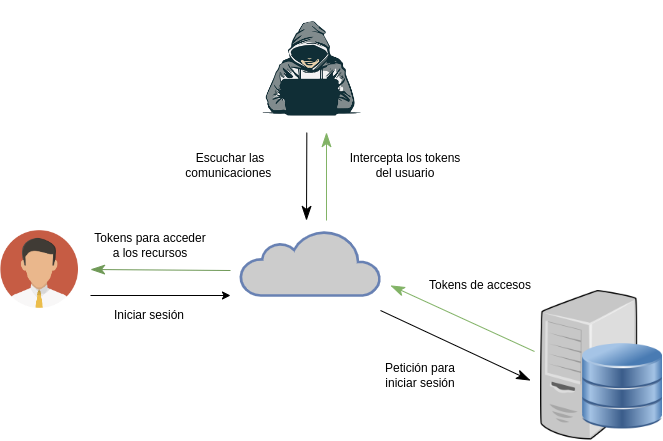
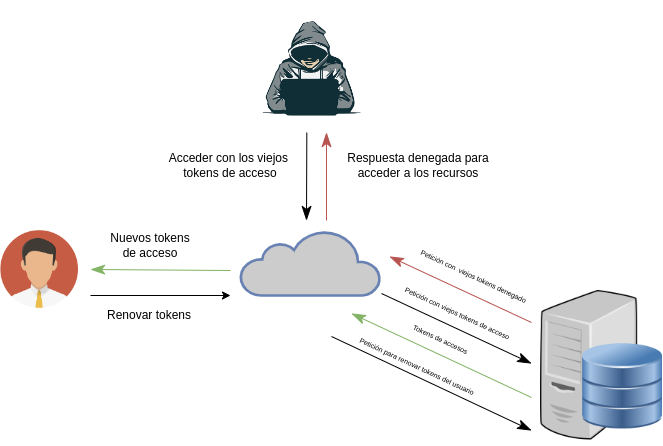

# Refresh token Demo - Spring Security

## Descripcion 

Este repositorio trata sobre la seguridad de spring con [Spring Security](https://spring.io/projects/spring-security) y [JWT](https://mvnrepository.com/artifact/io.jsonwebtoken/jjwt/0.9.1) para poder implementar **refresh token** junto al **access token**.

 La estrategia del **refresh token** permite hacer nuestro sistema un poco mas seguro contra atacantes que puedan obtener los tokens de acceso, teniendo **access token** con corto tiempo de expiración y refresh token rotativos o desactivados dependiendo cómo se implementen en el sistema. En este caso el **refresh token** es **rotativo** por lo tanto cada vez que el usuario inicie sesión o pida un refresh token nuevo, el **viejo refresh token** será eliminado de la base de datos. Esto evita que un atacante pueda renovar los tokens para poder acceder a los recursos del sistema, si obtuvo un refresh token viejo.

<p align="center">  
    
</p>

<p align="center">  
    
</p>

## Diseño del sistema

### Diagrama de caso de uso

<p align="center">  
    
</p> 

### Diagrama de secuencia
<p align="center">
    
</p>

## Apis

### Swagger 

Para poder probar las apis podemos acceder a la interfaz de Swagger en la siguiente URL:

[http://localhost:8080/swagger-ui/](http://localhost:8080/swagger-ui/)

### Postman

Para probar desde Postman podemos importar la colección de apis y el environments que se encuentran en la carpeta **postman** en la carpeta raiz

## Como ejecutarlo 

El sistema se podrá ejecutar a traves de **Maven** o **Docker Compose**

### Requisitos si se ejecuta con Maven

- Se deberá tener instalado:    

    - Maven    
    - JDK  versión 17    
    - Postgresql

Teniendo instalado todo lo próximo es abrir una terminal en la carpeta **example-auth** donde se encuentra el archivo **mvnw** y ejecutamos el siguiente comando para iniciar el sistema

```bash    
    ./mvnw spring-boot:run
```
Para finalizar el sistema, tocamos la combinación de teclas **Ctrl** + **C** en la terminal donde se ejecutó el anterio comando 

### Requisitos si se ejecuta con Docker Compose

- Se deberá tener instalado:    
    - Docker    
    - Docker Compose 

Teniendo instalado todo, lo que sigue es abrir una terminal en la carpeta **example-auth** y ejecutar los siguientes comandos

```bash    
   docker-compose build   
```
Una vez que termino de construir la imagen ejecutamos

```bash    
   docker-compose up -d 
```

Para finalizar el sistema, abrimos una terminal en la carpeta **example-auth** donde se encuentra el archivo **docker-compose.yml** y ejecutamos el siguiente comando

```bash
    docker-compose stop
```
